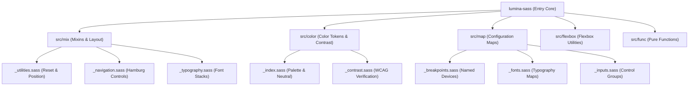

# System Architecture

Lumina SASS is structured as a modular design system built on Sass Indented Syntax (`.sass`). The framework compiles directly to static CSS without runtime JavaScript dependencies.

### Module Structure

- **`src/mix/`**: Contains layout, positioning, parametric resets, navigation controls, and component styling mixins.
- **`src/color/`**: Handles design token colors, palette generation, neutral tones, and WCAG AA automated contrast validation.
- **`src/map/`**: Centralized configuration maps for breakpoints, responsive limits, typography rules, and form controls.
- **`src/flexbox/`**: Mixins and atomic utility CSS classes for flexible grid and item alignment.
- **`src/func/`**: Pure calculation functions for luminance, contrast ratios, font fallbacks, and icon glyph lookup.

### Design Principles

1. **Zero Runtime Overhead:** All math calculations, map lookup operations, and WCAG compliance checks execute during build-time compilation.
2. **Parametric & Explicit Defaults:** Mixins utilize safe `false` or `null` defaults to prevent unwanted CSS property injection.
3. **Logical CSS Properties:** Layout calculations prioritize logical properties (`inline-size`, `block-size`, `inset-inline`) over physical dimensions.

### Draw.io Diagrams

The raw editable Draw.io XML diagram files are stored in `docs/diagrams/`:
- **[Module Architecture Diagram](diagrams/module_architecture.drawio):** Draw.io file for the module structure and relationship diagram.
- **[Build & Compilation Flow Diagram](diagrams/build_flow.drawio):** Draw.io file for the Sass compilation, WCAG AA verification, and test execution workflow.
- **[Contribution Workflow Diagram](diagrams/contribution_flow.drawio):** Draw.io file for the PR, reviewer request, and team notification workflow.
